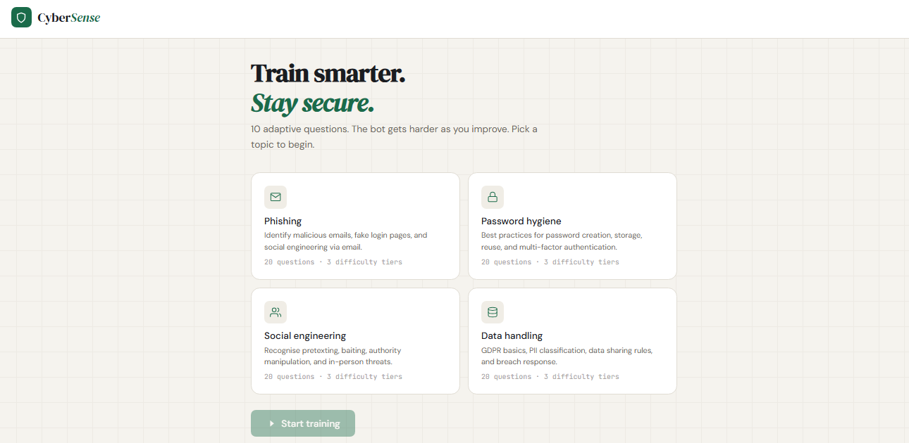
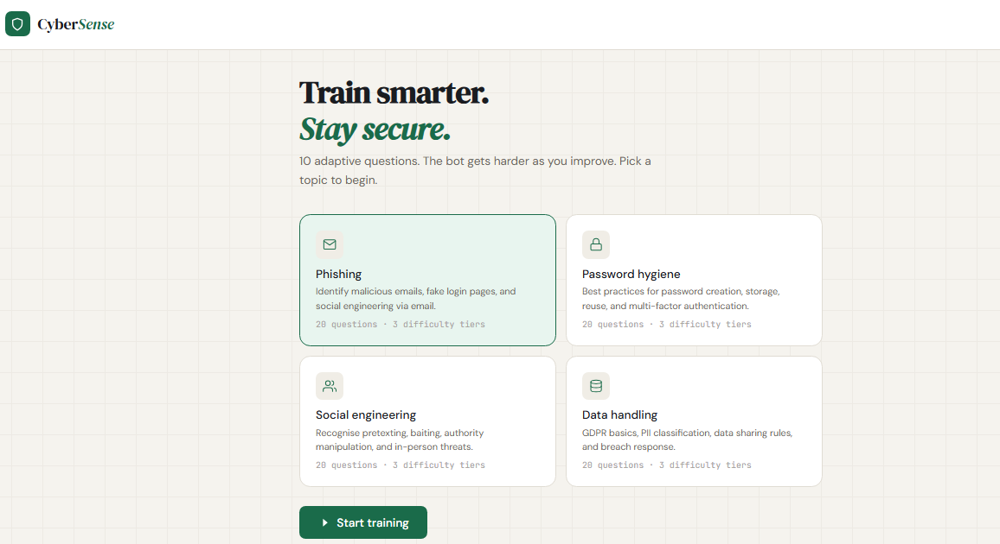
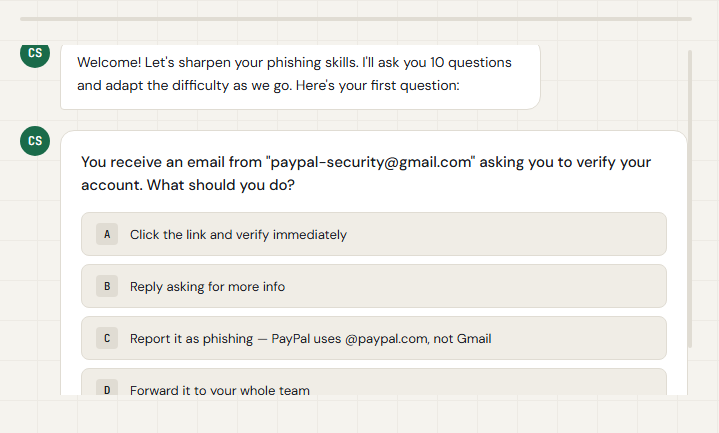
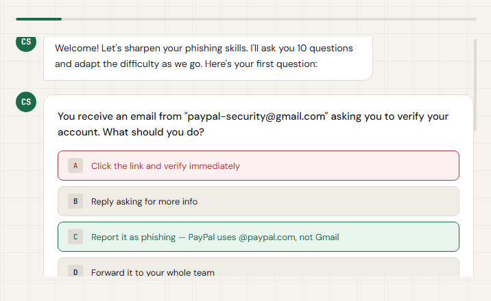
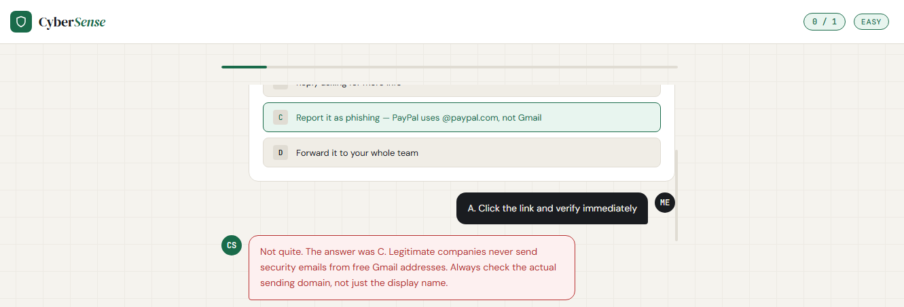

<div align="center">

# 🛡️ CyberSense
### Adaptive Security Awareness Training Chatbot

Train smarter. Stay secure.

An AI-powered cybersecurity training chatbot that quizzes employees, adapts question difficulty to their performance, and provides a personal report of strengths and weak areas.

[](#-how-it-works)
[](#-tech-stack)
[](#-airtable-session-log)
[](#-ethical-use)

`🎯 Adaptive questions` &nbsp; • &nbsp; `🧠 AI coaching` &nbsp; • &nbsp; `📊 Personal score reports` &nbsp; • &nbsp; `⚡ Demo mode`

</div>

---

## ✨ Overview

**CyberSense** makes security-awareness training more engaging than a static slide deck or a one-size-fits-all quiz.

Employees choose a topic, answer ten AI-guided questions, and receive feedback after every response. The chatbot adjusts difficulty in real time: sustained correct answers unlock harder questions, while repeated wrong answers bring the difficulty back to a more suitable level. At the end of the session, each learner receives a tailored score report with key improvement areas.

Every question-and-answer interaction can also be logged to Airtable, giving teams a simple way to track training sessions and identify organisation-wide knowledge gaps.

> **Built for practical cybersecurity learning—clear feedback, appropriate challenge, and measurable progress.**

---

## 🖼️ Product Walkthrough

### 1. Choose a training topic

Learners can select from four focused training modules before starting their session.



### 2. Confirm the topic and begin training

The selected module is clearly highlighted before the learner begins their ten-question adaptive session.



### 3. Answer realistic security scenarios

Questions are presented in a conversational format with clear multiple-choice options.



### 4. Receive immediate answer feedback

CyberSense highlights the selected answer, identifies the correct response, and helps the learner understand the reasoning.



### 5. Learn from personalised coaching

The chatbot gives practical explanations after each answer, reinforcing safer behaviour in future real-world situations.



---

## 🚀 Features

| Feature | Description |
| :--- | :--- |
| 🧩 **Four topic modules** | Train on Phishing, Password Hygiene, Social Engineering, or Data Handling. |
| 📚 **80 curated questions** | Includes 20 hand-written questions per module across easy, medium, and hard tiers. |
| 🎯 **Adaptive difficulty** | The chatbot adjusts the challenge level based on consecutive correct or incorrect answers. |
| 💬 **Real-time AI feedback** | Learners receive clear explanations after each answer rather than a score alone. |
| 📈 **Live progress tracking** | The interface displays question progress and the current difficulty level. |
| 📊 **Personalised completion report** | Each completed session includes a score, grade, and identified weak areas. |
| 🗂️ **Airtable session logging** | Every question-and-answer pair can be stored with a timestamp and difficulty level. |
| 🧪 **Demo mode** | Run the interface for portfolio demonstrations without configuring API credentials. |
| ⚙️ **No-code workflow automation** | n8n coordinates AI requests, session context, scoring, and Airtable logging. |

---

## 🧠 How It Works

```text
┌───────────────────────────┐
│  1. Learner picks a topic │
│  Phishing / Passwords /   │
│  Social Engineering / Data│
└─────────────┬─────────────┘
              │
              ▼
┌───────────────────────────┐
│  2. Frontend sends answer │
│  + full session context   │
└─────────────┬─────────────┘
              │
              ▼
┌───────────────────────────┐
│  3. n8n workflow routes   │
│  the request to AI agent  │
└─────────────┬─────────────┘
              │
       ┌──────┴──────┐
       ▼             ▼
┌────────────┐  ┌─────────────┐
│ AI feedback│  │ Airtable log│
│ + next Q   │  │ + analytics │
└──────┬─────┘  └─────────────┘
       │
       ▼
┌───────────────────────────┐
│  4. Learner sees feedback │
│  and the next question    │
└───────────────────────────┘
```

1. **Choose a topic** — The learner selects Phishing, Password Hygiene, Social Engineering, or Data Handling.
2. **Begin the assessment** — CyberSense starts a ten-question training session at an appropriate initial difficulty.
3. **Send answer context** — Each answer is sent to an n8n webhook alongside session history, score, topic, and current difficulty.
4. **Evaluate and coach** — The AI Agent evaluates the response, explains the answer, and selects the next question.
5. **Adapt the challenge** — The workflow raises or lowers the difficulty based on the learner's answer streak.
6. **Log the session** — Airtable stores each response for later review and reporting.
7. **Deliver the final report** — After ten questions, the learner receives a score, grade, and relevant training focus areas.

---

## 🎯 Training Modules

| Module | What Learners Practise |
| :--- | :--- |
| 📧 **Phishing** | Recognising malicious emails, fake login pages, suspicious domains, and social-engineering attempts. |
| 🔐 **Password Hygiene** | Password creation, secure storage, reuse risks, password managers, and multi-factor authentication. |
| 🧑‍💼 **Social Engineering** | Pretexting, baiting, authority manipulation, tailgating, and in-person threats. |
| 🗃️ **Data Handling** | Data classification, GDPR basics, secure sharing, PII protection, and breach response. |

---

## 📈 Adaptive Difficulty Logic

CyberSense adapts the session to keep training challenging without making it discouraging.

| Condition | Action |
| :--- | :--- |
| ✅ 2 correct answers in a row | Increase difficulty by one tier. |
| ❌ 2 incorrect answers in a row | Decrease difficulty by one tier. |
| 🏆 Correct answer at hard difficulty | Keep difficulty at hard. |
| 🌱 Incorrect answer at easy difficulty | Keep difficulty at easy. |

The current difficulty is included in every request to the AI Agent. This allows the workflow to choose an appropriately complex next question from the question bank.

```text
Easy  →  Medium  →  Hard
  ▲                  │
  └──── 2 wrong ─────┘

2 correct answers in a row move the learner forward.
2 incorrect answers in a row move the learner back.
```

---

## 📊 Completion Report

At the end of a ten-question session, CyberSense provides a personalised summary containing:

- 📈 Total score and number of correct answers
- 🏅 Grade: **Novice**, **Practitioner**, or **Expert**
- 🎯 Topic-specific strengths
- 🔍 Weak areas that need attention
- 💡 Suggested next steps for further learning
- 🗓️ Session completion record in Airtable

| Grade | Suggested Meaning |
| :--- | :--- |
| 🌱 **Novice** | Needs foundational security-awareness reinforcement. |
| 📘 **Practitioner** | Demonstrates a solid working knowledge of security best practices. |
| 🏆 **Expert** | Shows strong awareness across increasingly challenging scenarios. |

---

## 🧰 Tech Stack

| Component | Tool | Purpose |
| :--- | :--- | :--- |
| ⚙️ Automation | n8n (self-hosted) | Orchestrates webhooks, AI messages, scoring, and logging. |
| 🧠 AI Model | OpenRouter (Claude / GPT-4o) | Evaluates learner answers and generates feedback. |
| 📊 Score Tracking | Airtable | Stores session details, responses, scores, and difficulty. |
| 🖥️ Frontend | Single-file HTML, CSS, and JavaScript | Provides the chatbot and training interface. |
| 📚 Question Bank | JSON files | Stores 80 curated questions across three difficulty tiers. |
| 🧪 Seeding Script | Python 3 | Optionally loads the question bank into Airtable. |

---

## 💻 Run Locally

### Prerequisites

- n8n instance (self-hosted or cloud)
- OpenRouter API key
- Airtable API key and Base ID
- Python 3 (optional, for question-bank seeding)
- A modern web browser

### 1. Clone the repository

```bash
git clone https://github.com/YOUR_USERNAME/security-awareness-chatbot.git
cd security-awareness-chatbot
```

### 2. Import the n8n workflow

1. Open your n8n dashboard.
2. Select **Import workflow**.
3. Choose `n8n-workflow/chatbot.json`.
4. Add OpenRouter and Airtable credentials.
5. Activate the workflow when configuration is complete.

### 3. Set up Airtable

1. Create a new Airtable base using `airtable-schema/schema.md`.
2. Copy the Base ID.
3. Add the Base ID to your n8n Airtable credentials.
4. Ensure the Responses table is ready to receive session records.

### 4. Seed the question bank (optional)

```bash
pip install requests python-dotenv
cp .env.example .env
python3 scripts/seed-airtable.py
```

Add the following values to `.env` before running the script:

```env
AIRTABLE_API_KEY=your_airtable_api_key
AIRTABLE_BASE_ID=your_airtable_base_id
```

### 5. Connect the frontend

Open `frontend/index.html` and update the configuration:

```js
const WEBHOOK_URL = "https://your-n8n-instance/webhook/cybersense-chat";
const DEMO_MODE = false;
```

### 6. Run the frontend

Open `frontend/index.html` in a browser, or serve it locally:

```bash
cd frontend
python3 -m http.server 8080
```

Then visit:

```text
http://localhost:8080
```

---

## 🗂️ Airtable Session Log

Each learner interaction can be logged to Airtable for tracking and training analytics.

| session_id | topic | score | total_q | difficulty | grade |
| :--- | :--- | :---: | :---: | :--- | :--- |
| `sess_1713600000` | phishing | 8 | 10 | hard | Practitioner |
| `sess_1713601000` | passwords | 6 | 10 | medium | Practitioner |

Suggested fields for the **Responses** table:

- `session_id`
- `timestamp`
- `topic`
- `question_id`
- `question_text`
- `selected_answer`
- `correct_answer`
- `is_correct`
- `difficulty`
- `running_score`
- `feedback`
- `final_grade`

---

## 📁 Project Structure

```text
security-awareness-chatbot/
│
├── frontend/
│   └── index.html
│
├── n8n-workflow/
│   └── chatbot.json
│
├── airtable-schema/
│   └── schema.md
│
├── questions/
│   ├── phishing.json
│   ├── passwords.json
│   ├── social-engineering.json
│   └── data-handling.json
│
├── scripts/
│   └── seed-airtable.py
│
├── docs/
│   └── screenshots/
│       ├── topic-selection.png
│       ├── topic-selected.png
│       ├── training-question.png
│       ├── answer-feedback.png
│       └── chat-feedback.png
│
├── .env.example
└── README.md
```

---

## 🔐 Privacy & Security Notes

- Do not store API keys in frontend source code.
- Keep OpenRouter and Airtable credentials in n8n or environment variables.
- Restrict access to Airtable bases containing employee training data.
- Define an appropriate data-retention policy before production deployment.
- Use HTTPS for all production webhooks and frontend deployments.
- Review AI-generated feedback for accuracy and training-policy alignment.

---

## ⚖️ Ethical Use

CyberSense is built for **internal corporate cybersecurity-awareness training** and educational use.

- ✅ Use it to improve security knowledge and practise safe decision-making.
- ✅ Keep training questions educational and relevant to your organisation.
- ✅ Inform learners when their session data is collected or stored.
- ✅ Store only the minimum data needed for training analytics.
- ❌ Do not use it to collect unnecessary personal information.
- ❌ Do not use scores as the sole basis for employment, disciplinary, or performance decisions.
- ❌ Do not present AI feedback as a substitute for professional security policy or incident-response guidance.

---

## 👤 Author

Built by **[Jamiu Sosanya](#)** as a cybersecurity portfolio project.

[LinkedIn](https://www.linkedin.com/in/sosanya-temitope) • [GitHub](https://github.com/Jamiu-Sosanya)

---

<div align="center">

Built for stronger security habits, one scenario at a time. 🛡️

⭐ If you find this project useful, consider giving it a star.

</div>
